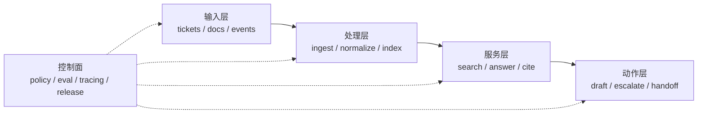

# AI System Blueprint v1｜AI 系统落地蓝图

> 用途：给后续课程和团队实现提供共同世界观。它不是架构炫技图，而是系统边界、输入输出和控制面的共同基线。

## 1. 系统一句话定义

- 系统名称：
- 一句话定义：
- 主要服务对象：
- 核心业务价值：

## 2. 业务世界观

| 对象 | 说明 | 示例 |
|---|---|---|
| 用户 |  |  |
| 工单 / Case |  |  |
| 知识文档 |  |  |
| 规则 / 政策 |  |  |
| 动作 / Tool |  |  |
| 审计事件 |  |  |

## 3. 输入、处理、服务、动作、控制

## 4. 七层架构草图

| 层 | 当前最小设计 | 后续周次会补什么 |
|---|---|---|
| 输入准入 |  | Week02 contracts / manifest |
| 采集与状态 |  | Week03 ingest / checkpoint |
| 湖仓状态层 |  | Week04 snapshot / evolution |
| Transform / 口径 |  | Week05 dbt / semantic contract |
| Orchestration |  | Week06 asset factory |
| Retrieval / Serving |  | Week08 API / evidence |
| 工具、评测、治理 |  | Week10+ tool / eval / release |

## 5. 首周运行基线

- 启动路径：
- 健康检查：
- seed loader dry-run：
- contract tests：
- RAG 冒烟查询：
- release / manifest 锚点：

## 6. 技术选型理由

| 选择 | 为什么选 | 当前边界 |
|---|---|---|
| Docker-only 本地启动 |  |  |
| Postgres |  |  |
| MinIO / object storage |  |  |
| Quarto / docs |  |  |
| 其他 |  |  |

## 7. 最小通过标准

- [ ] 同时画出了数据路径和控制面
- [ ] 没有只画成 LLM + 向量库三段式 Demo
- [ ] 说明了哪些能力本周只是基线，不是最终形态
- [ ] 能自然接到 Week02–Week05 的课程主线
- [ ] 能作为后续实验和作业的共同蓝图
