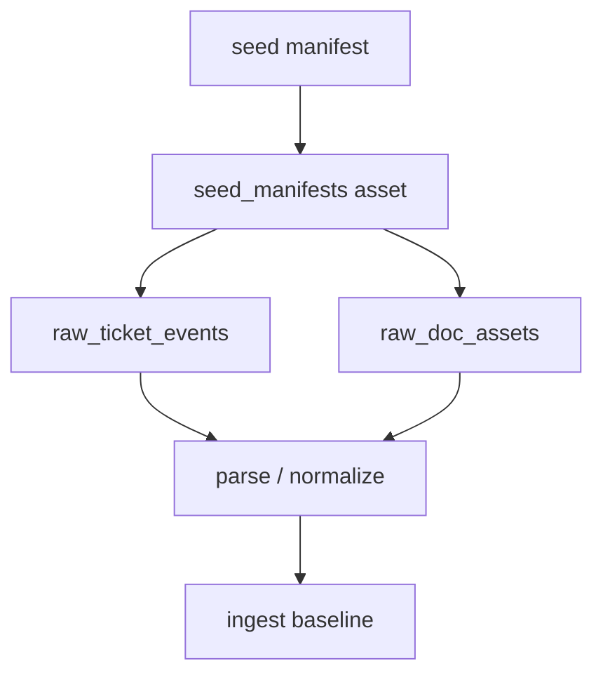

# Asset Flow Plan v1｜资产流设计

> 用途：把 ingest 从“脚本任务流”升级成“可被下游消费的资产流”，让 lineage、分区、补数和回放有稳定对象。

## 1. 输入资产

| Asset | 来源 | Contract | Manifest | Owner |
|---|---|---|---|---|
|  |  |  |  |  |
|  |  |  |  |  |

## 2. Asset Graph

## 3. 资产定义

| Asset | Grain | Partition | Upstream | Downstream | Freshness |
|---|---|---|---|---|---|
|  |  |  |  |  |  |
|  |  |  |  |  |  |

## 4. Materialization 证据

- run id：
- materialized assets：
- partition：
- record count：
- failed assets：
- report link：

## 5. 最小通过标准

- [ ] asset key 稳定
- [ ] 每个 asset 有 upstream / downstream
- [ ] manifest 和 contract metadata 没有丢
- [ ] partition / backfill 可以基于 asset 判断
- [ ] 能自然接到 Week04 / Week06
