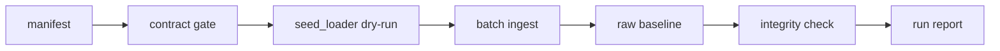

# Batch Ingestion Design v1｜批量采集设计

> 用途：说明批量采集主链路如何从 manifest 到 landing / raw / baseline，并证明它可以重跑、校验和对账。

## 1. Batch 范围

- batch name：
- source manifest：
- source system：
- 输入时间窗口：
- expected record count：
- target tables / files：

## 2. 主链路

## 3. 完整性检查

| 检查 | 规则 | 失败动作 |
|---|---|---|
| record count |  |  |
| required fields |  |  |
| checksum / file size |  |  |
| duplicate input |  |  |
| target write count |  |  |

## 4. 重跑策略

- rerun command：
- overwrite / append 策略：
- idempotency key：
- 重跑前检查：
- 重跑后对账：

## 5. 最小通过标准

- [ ] batch 边界来自 manifest，不靠口头约定
- [ ] 失败能记录到 run log
- [ ] rerun 不产生重复写入
- [ ] 完整性检查能解释 accept / quarantine / reject
