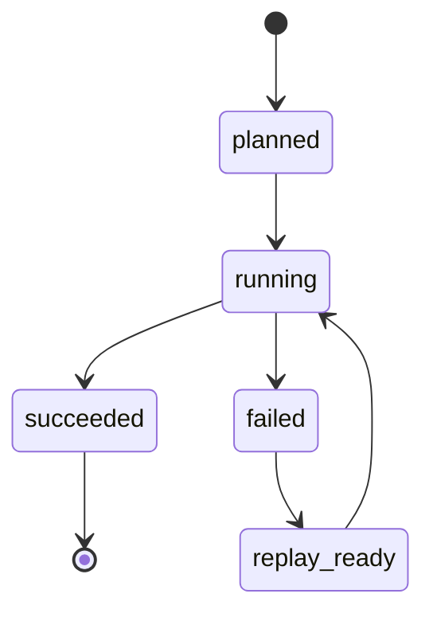

# Checkpoint State v1｜Checkpoint 状态结构

> 用途：把 ingest 状态持久化为可以恢复、回放、审计的结构，而不是只存在进程内存或日志文本里。

## 1. 状态记录字段

| 字段 | 类型 | 必填 | 说明 |
|---|---|---|---|
| `job_name` | string | yes | 采集任务名 |
| `source_system` | string | yes | 来源系统 |
| `manifest_id` | string | yes | 输入声明 |
| `run_id` | string | yes | 本次执行 ID |
| `cursor_value` | string | yes | 下一次读取起点 |
| `watermark_value` | string | yes | 已确认边界 |
| `checkpoint_at` | timestamp | yes | 写入时间 |
| `status` | string | yes | running / succeeded / failed / quarantined |
| `record_count` | integer | no | 已处理记录数 |
| `error_ref` | string | no | 错误引用 |

## 2. 状态迁移

## 3. 恢复规则

| 状态 | 可以做什么 | 不能做什么 |
|---|---|---|
| running | 观察、超时判定 | 直接覆盖 |
| failed | retry / replay 判断 | 继续推进 watermark |
| succeeded | 作为下一次起点 | 无证据回退 |
| quarantined | 人工复核 | 自动进入下游 |

## 4. 最小通过标准

- [ ] checkpoint 是持久化对象
- [ ] 每次 run 都有 run_id
- [ ] cursor / watermark / manifest 可追溯
- [ ] 失败状态不推进可信边界
- [ ] runbook 能根据状态做恢复判断
