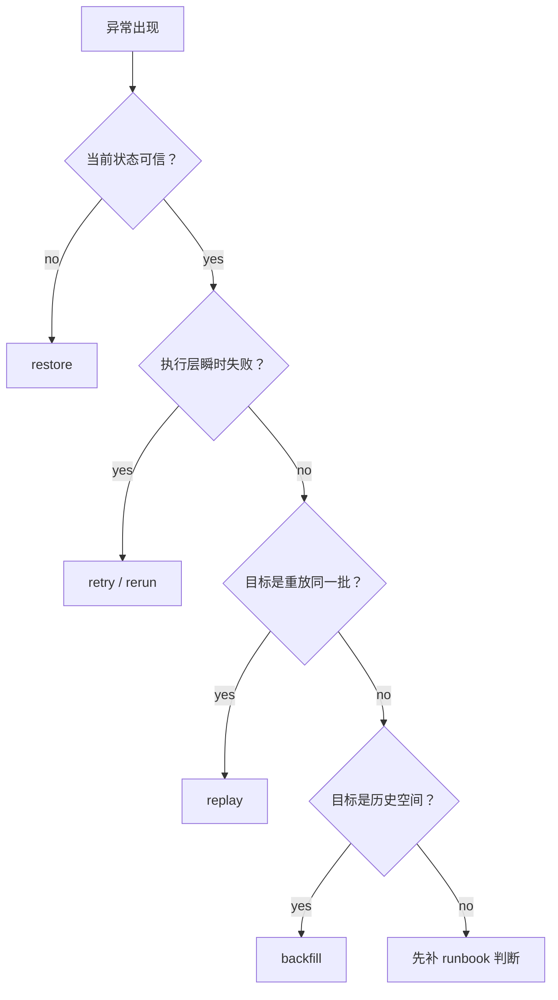

# Replay / Backfill Strategy v1｜Replay 与 Backfill 策略

> 用途：区分 retry、rerun、replay、restore、backfill，避免恢复动作混乱。

## 1. 概念边界

| 动作 | 适用场景 | 输入边界是否变化 | 目标 |
|---|---|---|---|
| retry | 瞬时失败 | 不变 | 同一次执行重试 |
| rerun | 作业定义重跑 | 不变 | 重跑同一任务 |
| replay | 重放同一批输入 | 不变 | 重建当时接入 |
| restore | 当前状态不可信 | 先回到可用状态 | 恢复可信基线 |
| backfill | 历史缺口或旧分区 | 变化 | 补历史范围 |

## 2. 决策树

## 3. 运行记录

| 字段 | 填写 |
|---|---|
| incident id |  |
| detected at |  |
| affected source |  |
| affected partition |  |
| chosen action | retry / rerun / replay / restore / backfill |
| reason |  |
| evidence |  |
| result |  |

## 4. 最小通过标准

- [ ] 能解释为什么选择当前恢复动作
- [ ] replay 和 backfill 没有混用
- [ ] restore 后是否还需要 replay / backfill 有判断
- [ ] 结果写入 run log / report
- [ ] 下游是否需要重建已说明
